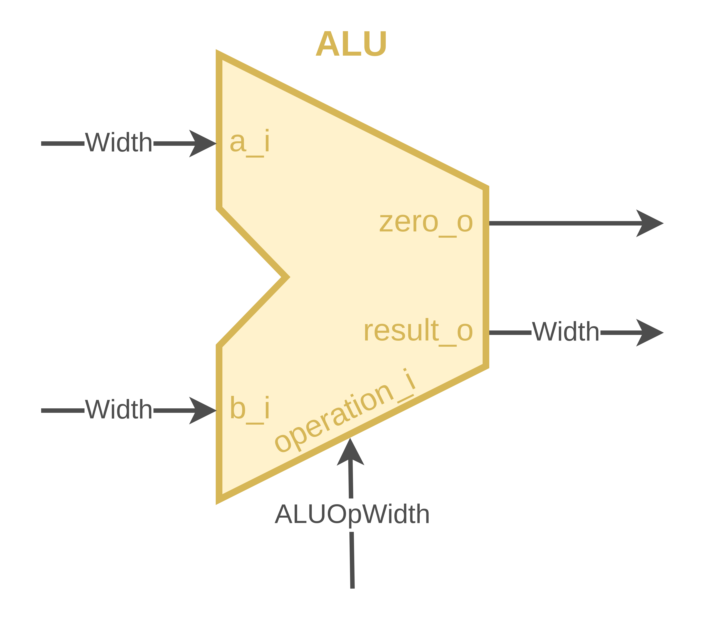
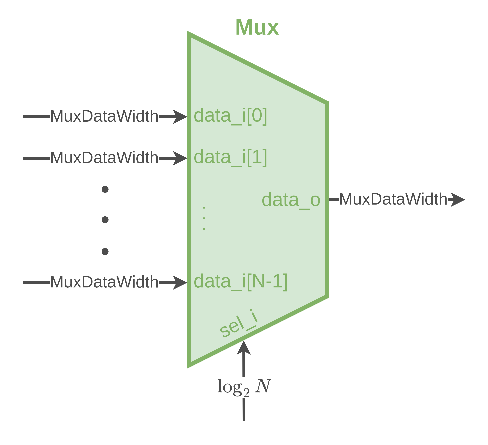
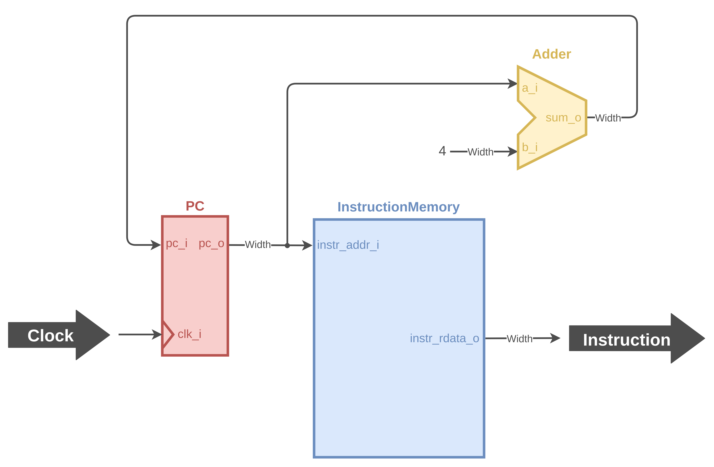

# XMint | RISC-V32 Single Cycle Core Design

## **1. Introduction**

The XMint project implements a RISC-V32 single-cycle core using Verilog. This document provides a comprehensive overview of the design architecture, detailing the datapath and the core components involved in the implementation.

## **2. Design Overview**

### **2.1 Architecture**

The XMint core is designed as a single-cycle processor, where each instruction is executed within a single clock cycle. This design approach simplifies control logic and lays the groundwork for potential pipelining in future revisions, enhancing performance.

### **2.2 Core Components**

The architecture comprises the following key components:

- **Instruction Memory (IMEM)**: Stores the instructions to be executed by the CPU.
- **Program Counter (PC)**: Tracks the address of the next instruction to be executed.
- **Adder**: Performs arithmetic operations, particularly addition.
- **Register File**: Stores data operands for instructions and facilitates reading and writing of register values.
- **ALU**: Executes arithmetic and logical operations on the data.
- **ALU Control**: Generates control signals for the ALU based on the instruction type.
- **Data Memory (DMEM)**: Stores data that the CPU accesses during instruction execution.
- **Immediate Generation (ImmGen)**: Generates immediate values used in various instructions.
- **Multiplexor (Mux)**: Selects between multiple inputs to route to a single output.
- **Control Unit**: Directs operation by generating control signals for various components.

#### **2.2.1 Instruction Memory (IMEM)**

The Instruction Memory (IMEM) is critical for holding the instructions that the CPU will process.

#### **2.2.2 Program Counter (PC)**

The Program Counter (PC) is a crucial component that holds the address of the next instruction to be fetched from memory. It increments with each clock cycle, ensuring the sequential execution of instructions unless a branch or jump instruction modifies its value.

#### **2.2.3 Adder**

The Adder is a fundamental component in the XMint core, responsible for performing arithmetic addition. It is used primarily in two contexts:

1. **PC Increment**: The Adder adds a constant value (typically 4) to the current value of the Program Counter (PC) to fetch the next instruction sequentially.
2. **Branch Address Calculation**: When a branch instruction is executed, the Adder computes the target address by adding an offset to the current PC value.

This functionality is crucial for the correct operation of the control flow within the processor.

#### **2.2.4 Register File**

The Register File is a vital component of the XMint core, responsible for storing and managing the CPU's registers. Key features include:

- **Storage Capacity**: The Register File typically contains 32 registers (x0 to x31) that can store 32-bit values.
- **Read and Write Operations**: It supports simultaneous read and write operations, allowing the CPU to access data quickly during instruction execution.
- **Zero Register**: The zero register (x0) is hardwired to zero, providing a constant value for operations that require a zero input.

The Register File plays a crucial role in executing instructions by supplying operands to the ALU and storing results.

#### **2.2.5 ALU**

The Arithmetic Logic Unit (ALU) is a critical component of the XMint core, responsible for performing a variety of arithmetic and logical operations. Key features of the ALU include:

- **Arithmetic Operations**: The ALU can perform basic arithmetic operations such as addition, subtraction, multiplication, and division. In the context of RISC-V32, it primarily supports addition and subtraction.

- **Logical Operations**: It can execute logical operations like AND, OR, NOT, and XOR, essential for manipulating binary data and implementing conditional operations.

- **Input Selection**: The ALU receives its inputs from the Register File, allowing it to operate on the values stored in the CPU's registers.

- **Output**: The result of the ALU's computation is sent back to the Register File or to data memory, depending on the instruction type.

The ALU is essential for executing instructions that require data manipulation and plays a crucial role in the overall functionality of the core.

#### **2.2.6 ALU Control**

The ALU Control unit is responsible for generating the control signals required by the ALU based on the instruction being executed. It takes inputs from the instruction's **Opcode**, **Funct3**, and **Funct7** fields to determine the specific operation that the ALU should perform. Key features include:

- **Control Signal Generation**: The ALU Control unit interprets the instruction encoding to produce the appropriate control signals for the ALU. These signals dictate whether the ALU performs an arithmetic operation (like addition or subtraction) or a logical operation (such as AND or OR).

- **Support for Different Instruction Types**: By handling various instruction formats, the ALU Control can manage R-Type, I-Type, and other instruction formats effectively.

- **Combining Funct3 and Funct7**: The unit combines the Funct3 and Funct7 fields to differentiate between operations that may use the same opcode but require different ALU behaviors.

- **Output to ALU**: The generated control signals are sent to the ALU, guiding its operations during instruction execution.

This component ensures that the ALU functions correctly based on the specific requirements of each instruction.

#### **2.2.7 Data Memory (DMEM)**

Data Memory (DMEM) is a vital component of the XMint core, responsible for storing data that the CPU needs to access during instruction execution. Key features of DMEM include:

- **Storage Capability**: DMEM typically supports a range of addresses, allowing it to store a significant amount of data (e.g., 32-bit words).

- **Read and Write Operations**: The Data Memory supports both read and write operations, enabling the CPU to fetch data from memory and store results back into memory as needed.

- **Load and Store Instructions**: DMEM interacts closely with load (LW) and store (SW) instructions, which are essential for transferring data between the CPU and memory.

The Data Memory component is crucial for maintaining the state of programs and providing the necessary data for computation.

#### **2.2.8 Immediate Generation (ImmGen)**

The Immediate Generation unit (ImmGen) is essential for producing immediate values used in various instructions. Key features of ImmGen include:

- **Immediate Value Extraction**: ImmGen extracts immediate values from the instruction encoding. These values are often used in arithmetic operations, branch instructions, and loading data.

- **Sign Extension**: The unit performs sign extension to ensure that the immediate value has the correct sign when it is used in operations. This is particularly important for operations like subtraction, where negative values are involved.

- **Support for Different Formats**: ImmGen supports multiple instruction formats (e.g., I-type, S-type) to generate the appropriate immediate values based on the type of instruction being executed.

The Immediate Generation unit enhances the flexibility of the processor by enabling it to handle a wide range of instructions that require immediate data.

#### **2.2.9 Multiplexor (Mux)**

The Multiplexor (Mux) is a critical component used to select one of several input signals and forward the selected input into a single line. It plays a vital role in controlling the flow of data within the processor. Key features of the Mux include:

- **Input Selection**: A Mux can have multiple inputs and is controlled by selection lines that determine which input to send to the output. This is essential for routing data from different sources based on the current operation.

- **Data Paths**: The Mux is often used to select between the output of the ALU and the data from memory, allowing the processor to choose between different data paths depending on the instruction being executed.

- **Simplifying Control Logic**: By using a Mux, the design can be simplified as it reduces the number of direct connections needed between components, making the overall architecture cleaner and easier to manage.

- **Support for Various Operations**: Muxes are used in different parts of the datapath, including instruction decoding, ALU operation selection, and data routing to the Register File.

#### **2.2.10 Control Unit**

The Control Unit (CU) orchestrates the overall operation of the XMint core by generating the necessary control signals for various components based on the instruction being executed. Key features of the Control Unit include:

- **Instruction Decoding**: The CU interprets the opcode of the fetched instruction to identify the operation that needs to be performed. This involves determining whether the instruction is a load, store, arithmetic operation, branch, or other types.

- **Control Signal Generation**: Based on the decoded instruction, the CU produces control signals that dictate the operation of the ALU, the selection of inputs to the Muxes, and the read/write operations for the Register File and Data Memory.

- **Branch Control**: The CU manages the branching logic, ensuring that the Program Counter (PC) is updated correctly for branch and jump instructions, directing the flow of execution as needed.

- **Timing Coordination**: The Control Unit ensures that all components operate in synchrony with the clock signal, managing the timing of read/write operations and ALU processing to maintain proper sequence.

- **Modular Design**: The CU is designed to be modular, allowing for easy updates and enhancements in response to new instruction formats or changes in architecture.

This component is critical for ensuring that the processor operates correctly and efficiently, coordinating the actions of all other components in the core.

## **3. Datapath**

The datapath integrates all components, facilitating the flow of data during instruction execution. It is divided into several parts to handle different operations efficiently.

### **3.1 Datapath for Instruction Fetch**

The Instruction Fetch datapath is responsible for retrieving the next instruction from memory based on the address provided by the Program Counter (PC). During this operation, the following steps occur:

1. The Program Counter (PC) provides the address of the instruction to the Instruction Memory (IMEM).
2. The IMEM retrieves the instruction stored at that address.
3. The PC is incremented to point to the next instruction, preparing for the upcoming fetch cycle.

### **3.2 Datapath for Branch**

The Branch datapath is responsible for handling branch instructions, which modify the flow of execution based on conditions. The following steps outline this process:

1. **Immediate Value Generation**: The ImmGen generates the immediate value from the instruction, which is often a signed offset.
2. **Branch Target Calculation**: The Adder computes the target branch address by adding the immediate value to the current PC value.
3. **Condition Evaluation**: The ALU evaluates the condition for the branch (e.g., checking if two registers are equal for a BEQ instruction).

This mechanism allows for dynamic control flow in the execution of programs.

### **3.3 Datapath for Memory Instructions and R-Type Instructions**

The datapath for Memory Instructions and R-Type Instructions integrates the components necessary to execute load/store and register-based operations. The following steps outline this process:

1. **Instruction Fetch**: The instruction is fetched from IMEM using the PC, as previously described.
2. **Immediate Value Generation**: For load/store instructions, the ImmGen generates the immediate value which will be added to the base address from the register.
3. **ALU Operation (for R-Type)**: For R-Type instructions, the ALU receives input from the Register File, executes the specified operation (e.g., ADD, SUB), and produces a result.
4. **Memory Access (for Load/Store)**:
   - **Load Instruction (LW)**: The ALU calculates the effective address by adding the immediate value to the base address from a specified register. The Data Memory (DMEM) is then accessed to retrieve the data from the computed address.
   - **Store Instruction (SW)**: Similar to LW, the ALU computes the effective address. The data to be stored is taken from another register and written to the computed address in DMEM.
5. **Result Write-back**: The result from the ALU operation (for R-Type) or the loaded data (for LW) is written back to the Register File.

This process ensures that both types of instructions can be executed efficiently, allowing for a seamless flow of data and control within the processor.

## **4. Conclusion**

The XMint project effectively demonstrates the implementation of a RISC-V32 single-cycle core using Verilog. The modular design not only allows for straightforward expansion and testing of individual components but also serves as a foundation for future enhancements, including performance optimizations and the potential introduction of pipelining.

## **5. References**

- **Computer Organization and Design - RISC-V Edition: The Hardware/Software Interface**