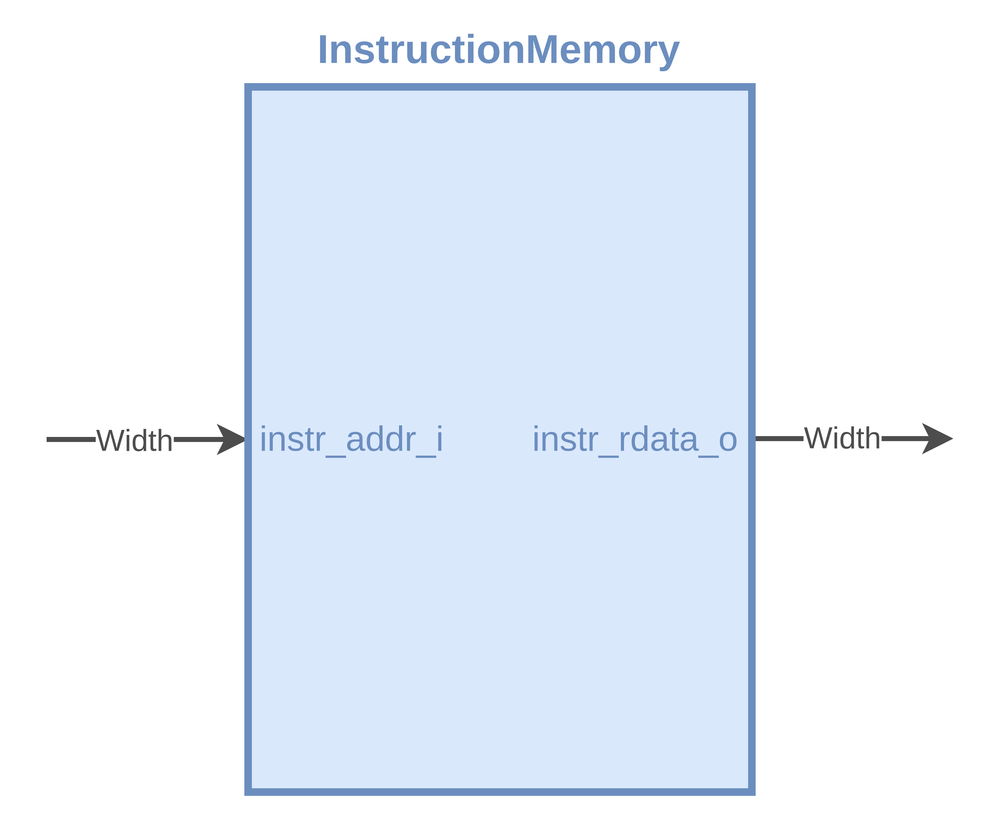

# XMint | RISC-V32 Single Cycle Core Design

## **1. Introduction**

The XMint project implements a RISC-V32 single-cycle core using Verilog. This document provides a comprehensive overview of the design architecture, detailing the datapath and the core components involved in the implementation.

## **2. Design Overview**

### **2.1 Architecture**

The XMint core is designed as a single-cycle processor, where each instruction is executed within a single clock cycle. This design approach simplifies control logic and lays the groundwork for potential pipelining in future revisions, enhancing performance.

### **2.2 Core Components**

The architecture comprises the following key components:

- **Instruction Memory (IMEM)**: Stores the instructions to be executed by the CPU.
- **Program Counter (PC)**: Tracks the address of the next instruction to be executed.
- **Adder**: Performs arithmetic operations, particularly addition.

#### **2.2.1 Instruction Memory (IMEM)**

The Instruction Memory (IMEM) is critical for holding the instructions that the CPU will process.

#### **2.2.2 Program Counter (PC)**

The Program Counter (PC) is a crucial component that holds the address of the next instruction to be fetched from memory. It increments with each clock cycle, ensuring the sequential execution of instructions unless a branch or jump instruction modifies its value.

#### **2.2.3 Adder**

The Adder is a fundamental component in the XMint core, responsible for performing arithmetic addition. It is used primarily in two contexts:

1. **PC Increment**: The Adder adds a constant value (typically 4) to the current value of the Program Counter (PC) to fetch the next instruction sequentially.
2. **Branch Address Calculation**: When a branch instruction is executed, the Adder computes the target address by adding an offset to the current PC value.

This functionality is crucial for the correct operation of the control flow within the processor.

## **3. Datapath**

The datapath integrates all components, facilitating the flow of data during instruction execution. Below is a simplified diagram illustrating the datapath for the XMint core.

## **4. Conclusion**

The XMint project effectively demonstrates the implementation of a RISC-V32 single-cycle core using Verilog. The modular design not only allows for straightforward expansion and testing of individual components but also serves as a foundation for future enhancements, including performance optimizations and the potential introduction of pipelining.

## **5. References**

- **Computer Organization and Design - RISC-V Edition: The Hardware/Software Interface**